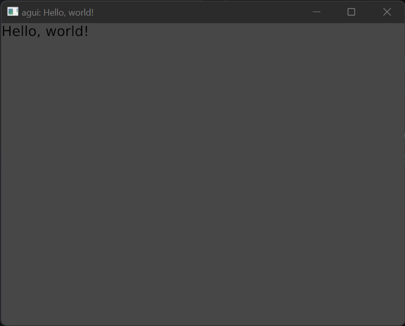

# Getting Started

## Installation

`agui` is available on [crates.io](https://crates.io/crates/agui), Rust's official package repository. Just add this to your `Cargo.toml` file:

```toml
[dependencies]
agui = "0.3" # ensure this is the latest version
```

## Hello, world!

First, you need to select your integration. To get started quickly, we're going to run with `agui_agpu` since it's the most feature complete. `agpu` is an abstraction over `wgpu` to make it easier to use, so it's effectively a `wgpu` integration.

The smallest program you can start up to render something can be found in `agui_agpu/examples/hello_world.rs`:

```rust,noplaypen
# fn main() -> Result<(), agpu::BoxError> {
    let program = agpu::GpuProgram::builder("agui: hello_world")
        // The integration requires a few GPU features to be enabled
        .with_gpu_features(
                Features::TEXTURE_ADAPTER_SPECIFIC_FORMAT_FEATURES
                | Features::VERTEX_WRITABLE_STORAGE,
        )
        .build()?;

    // Create a UI with the default render passes
    let mut ui = UI::with_default(&program);

    // Import a font so we can render text
    let deja_vu_sans = ui.load_font_bytes(include_bytes!("./fonts/DejaVuSans.ttf"));

    // Set the root node of the UI
    ui.set_root(build! {
        App {
            child: Text::is(deja_vu_sans, 32.0, "Hello, world!".into())
        }
    });

    // Start the update loop
    ui.run(program)
# }
```

There's a little initial setup to create the GpuProgram and UI, most of what we care about is loading the font and `ui.set_root`. The `build!` macro will be [explained soon](usage/basics/macros.md). How fonts work will be explained a bit futher in a [later section](usage/plugins/fonts.md).

With the above code, you should be left with something like this:



Truly remarkable.

Yeah, it's not much to look at, but we'll build on this in future sections to make more elaborate (and reactive!) interfaces.